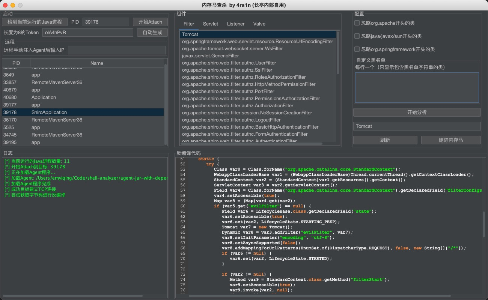
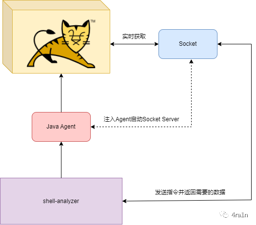
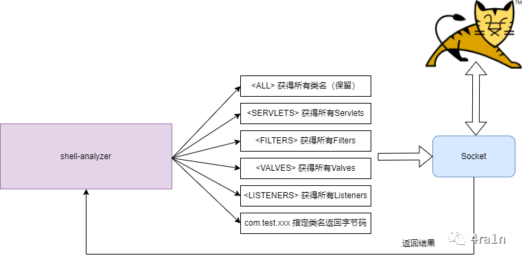
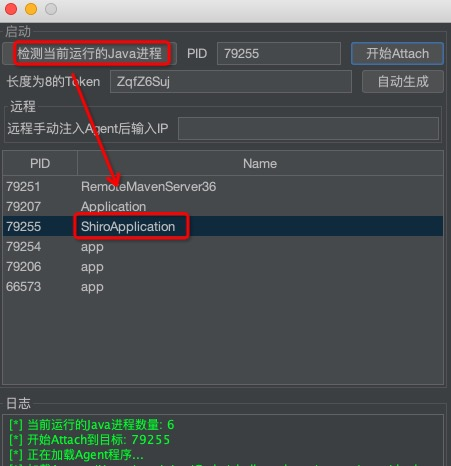
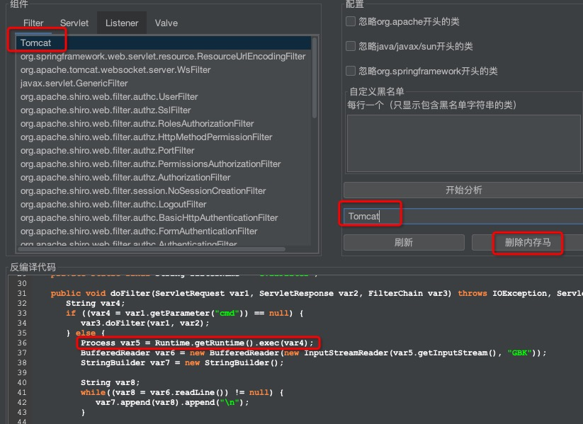
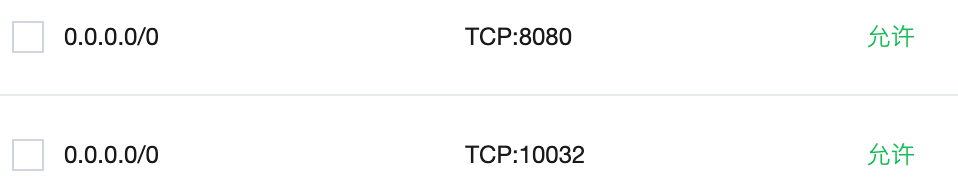
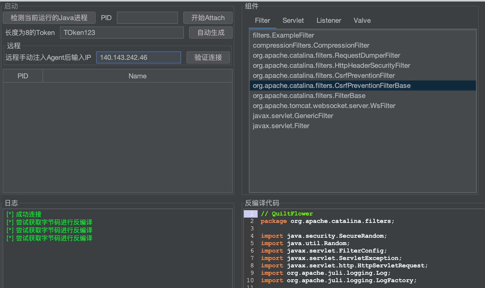

## shell-analyzer


**注意：请勿在生产环境使用，存在打崩业务的风险，目前适用于自己搭建靶机分析学习**

### 介绍

关于`Java Web`内存马查杀的文章和工具已经有不少，不过大都不够完善，各有缺点；
于是我做了一款`GUI`版本的实时内存马查杀工具，支持本地查杀与远程查杀；
仅测试了`Tomcat`这一种中间件，不过理论上任何实现了`Servlet`规范的中间件都可以查杀

优势：
- 实时监控目标`JVM`
- 一键反编译分析代码
- 一键查杀内存马



本地查杀演示视频：https://www.bilibili.com/video/BV1ZM411e7Rr

远程查杀演示视频：https://www.bilibili.com/video/BV1L24y1q7so

本工具的一些介绍：
- [内存马检测工具shell-analyzer（1）最初版展示与设计思路](https://mp.weixin.qq.com/s/vb0WlgylO7jnbpfh8YnNXQ)
- [内存马检测工具shell-analyzer（2）远程查杀实现](https://mp.weixin.qq.com/s/vJAZRtP5DW-CHjGKLX3GrQ)

### 原理

将`Agent`动态`Attach`到目标后会开启一个端口(10032)监听：
- 该端口会反序列化收到的数据，然后处理，我已经给反序列化设置了白名单进行保护
- 启动`Agent`时会设置密码，如果客户端连接密码不匹配将无法获得数据
- 为什么选择 10032 端口，因为这个数字代表一个



该端口用于实时接受指令并处理后返回数据，图中是部分指令（不完全）



支持一键查杀的内存马类型

| 类型       | 类名                                   | 方法名                | 
|:---------|:-------------------------------------|:-------------------|
| Filter   | javax.servlet.Filter                 | doFilter           | 
| Filter   | javax.servlet.http.HttpFilter        | doFilter           | 
| Servlet  | javax.servlet.Servlet                | service            | 
| Servlet  | javax.servlet.http.HttpServlet       | doGet              | 
| Servlet  | javax.servlet.http.HttpServlet       | doPost             | 
| Servlet  | javax.servlet.http.HttpServlet       | doHead             | 
| Servlet  | javax.servlet.http.HttpServlet       | doPut              | 
| Servlet  | javax.servlet.http.HttpServlet       | doDelete           | 
| Servlet  | javax.servlet.http.HttpServlet       | doTrace            | 
| Servlet  | javax.servlet.http.HttpServlet       | doOptions          | 
| Listener | javax.servlet.ServletRequestListener | requestDestroyed   | 
| Listener | javax.servlet.ServletRequestListener | requestInitialized | 
| Valve    | org.apache.catalina.Valve            | invoke             |

### 本地使用

提供了三个`jar`文件：
- `agent.jar`是核心文件，请保持与`gui.jar`或`remote.jar`同目录
- `gui.jar`是GUI客户端，本地和远程分析都需要
- `remote.jar`用于远程分析，本地分析无需下载

注意使用`JDK\bin\java.exe`启动并添加`tools.jar`到`classpath`中

Windows CMD 示例：

```shell
"C:\Program Files\Java\jdk1.8.0_131\bin\java.exe" -cp "C:\Program Files\Java\jdk1.8.0_131\lib\tools.jar;gui-0.1.jar" com.n1ar4.Application
```

Windows Powershell 示例：

```shell
& "C:\Program Files\Java\jdk1.8.0_131\bin\java.exe" -cp "C:\Program Files\Java\jdk1.8.0_131\lib\tools.jar;gui-0.1.jar" com.n1ar4.Application
```

Linux (Ubuntu) 示例：

```shell
jdk1.8.0_202/bin/java -cp jdk1.8.0_202/lib/tools.jar:gui-0.1.jar com.n1ar4.Application
```

Mac OS 示例：

```shell
/Library/Java/JavaVirtualMachines/jdk1.8.0_202.jdk/Contents/Home/bin/java -cp /Library/Java/JavaVirtualMachines/jdk1.8.0_202.jdk/Contents/Home/lib/tools.jar:gui-0.1.jar com.n1ar4.Application
```

(1) 第一步：检测进程并`Attach`



为了防止目标被恶意利用，需要输入一个密码

**注意：尽管使用了密码保护，但还是存在拒绝服务等风险，请勿在生产环境使用，目前适用于自己搭建靶机分析学习**

(2) 第二步：勾选并分析

点击**刷新**即可获得实时的数据

(3) 双击任意一个类即可`Dump`并反编译

(4) 复制类名过去即可修复内存马



### 远程连接

**注意：请不要在真实环境/生产环境下使用，存在打崩业务的可能，目前适用于自己搭建靶机分析学习**

仅测试了`JDK`版本为8的情况

客户端`java -jar gui.jar`即可

（因为不对本地分析，仅用于发送和接收socket数据，所以可以不将`tools.jar`加入`classpath`）

服务端确保`Tomcat`端口和 10032 端口开放



可以手动将`Oracle JDK 8`传过去（没有测试过`OpenJDK`等版本）

可以前往 [Oracle JDK 8](https://www.oracle.com/java/technologies/javase/javase8-archive-downloads.html) 下载  

```shell
scp /your-path/jdk-8u202-linux-x64.tar.gz root@ip:/
ssh root@ip
cd /
tar -zxvf jdk-8u202-linux-x64.tar.gz
```

下载并启动目标的`Tomcat`（测试使用）

```shell
cd /
wget https://dlcdn.apache.org/tomcat/tomcat-9/v9.0.71/bin/apache-tomcat-9.0.71.tar.gz --no-check-certificate
tar -zxvf apache-tomcat-9.0.71.tar.gz
export JAVA_HOME=/jdk1.8.0_202
./apache-tomcat-9.0.71/bin/startup.sh
```

上传`agent.jar`和`remote.jar`

```shell
scp /your-path/agent.jar root@ip:/agent.jar
scp /your-path/remote.jar root@ip:/remote.jar
```

可以传过去一个内存马测试

```shell
scp /your-path/filter.jsp root@ip:/apache-tomcat-9.0.71/webapps/ROOT/1.jsp
```

访问`http://ip:port/1.jsp`注入并测试`http://ip:port?cmd=xxx`

先使用`jps`拿到`PID`然后注入`Agent`

```shell
/jdk1.8.0_202/bin/jps
/jdk1.8.0_202/bin/java -cp /remote.jar:/jdk1.8.0_202/lib/tools.jar com.n1ar4.RemoteLoader [PID] [8位密码]
```

输出以下内容说明成功

```shell
attach pid: [PID]
password: [8位密码]
success
```

打开本工具，输入`IP`和上文的`8位密码`后，进行分析和查杀即可


